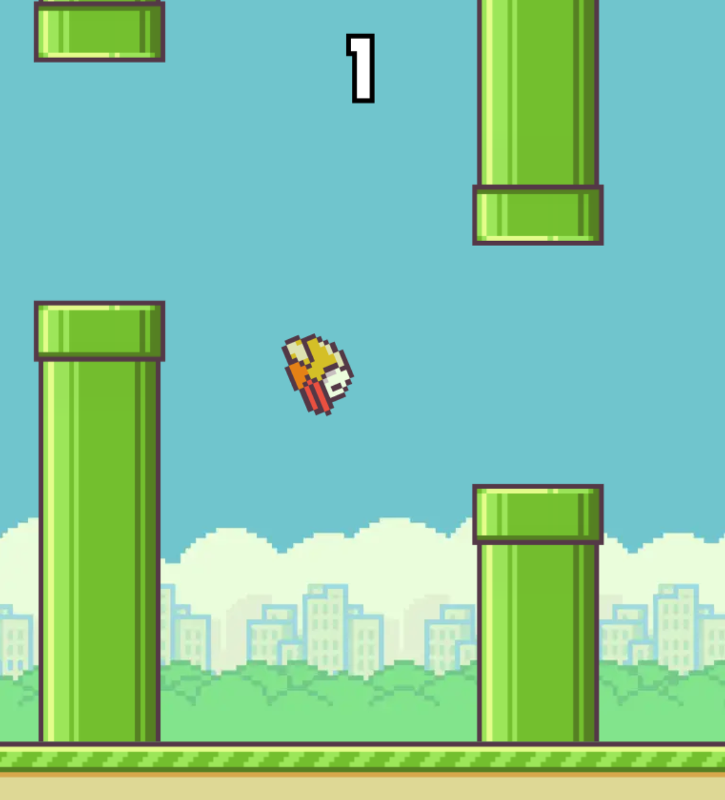

# Video Game Prototyping With Unity - _Flappy Bird_

>[!TIP]
> Play [this version of _Flappy Bird_](https://flappybird.io/)  to get an idea of what the game play is like.
>
> ( You can CTRL+Click / CMD+Click on the link to open it in a new tab. )

This guide assumes that you've fully completed the previous tutorial or have beginner knowledge of Unity and C#.

### Contents
***
* [Project Setup](/01_Setup/SETUP.md)

---
>Next: [Project Setup](/01_Setup/SETUP.md)
